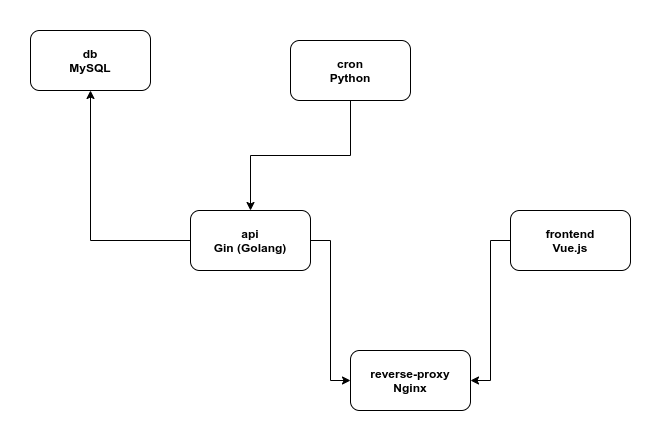

# Alethia: an *Atelier* project
### Project Developers: 
 - Amir Mohammad Tavakkoli 
 - Aref Sayareh
 - Amir Masoud Baghi


## Overview
Alethia is an Atelier project, done as the final project of "Database Design" course. The goal of this project was to implement a web application, emulating the famous website "LinkedIn".
LinkedIn offers tons of great features and services in its website while incorporating database-related concepts, which was of great interest for this project as the final task of the mentioned course.
We tried to incorporate as much features of the original website as possible into our own web app, while customizing them according to our own preferences and making it our own. As well as including the main features and user services of the original website,
we tried to integrate newer and more novel technologies such as Docker and gRPC into the project as well to offer a faster, more secure, and much more convenient experience overall. Using such technologies allows further development of our web app while being compatible
and up to date with the methods currently used. As for educational purposes, learning and incorporating the mentioned services allowed us, as developers, to learn valuable and fresh concepts and tools which we could use in future projects.

<br>

## Main Parts and Features of the Website

<br>

### User Management
As LinkedIn and all the other websites offer, our web app supports user management services, which includes: registration, logging in, including personal descriptions in their user profile and editing them when needed.
The personal description provided for each user in their profile is subdivided into following categories: Introduction, About, Featured Posts, Background Skills, Accomplishments, Additional Information, and Supported Languages.
Each user can fill and edit each of these subcategories on their profile to further describe and present themselves to the website's social space. Also users can endorse each other's skills and the number of skill endorsements appear on the user's skills.

<br>

### Post Management
Posts are an important part of LinkedIn's social environment. Therefore, our web app supports post management, as well as including the services that the original website provides regarding posts. Each user can post or share a post and star them as a featured post of their own,
which in turn will show up in their user profile, in the featured posts section. Each post can be liked and commented on, and each user can in turn see the number of likes and comments for each post. Comments can also be liked, and replying is also supported for comments under a post.
As LinkedIn provides, as a user with a network, posts related to your friends are shown in your main feed (which we call the Home page), based on certain criteria; posts shown in a user's feed are either liked, commented on, or simply posted by one of their friends.
So a user can see the content that their network is currently sharing.

<br>

### User Search
User and individual search is a prominent part of a website that is based on employment, social network, and business. Our web app supports searching users based on specific factors to provide the most related results. By default, searching for a user (by their username) is based on the number of mutual connections
that users with similar username have with the current user, so the search results are sorted by the number of mutual connections. As well as filtering by mutual connections, users can filter their search by location, languages that the user speaks, their current company or all three.

<br> 

### Notifications 
Notifications for certain events are supported to inform users of certain occasions. Notifications are supported for:
1. When today marks the birthday of a friend
2. When someone views your profile
3. When someone likes one of your posts
4. When someone comments on one of your posts
5. When someone likes or replies one of your comments
6. When someone endorses a skill of yours
7. When the current title of a user in your network changes

There is a specific page for seeing all notifications in one place, which is accessible by a button in the app bar. 


<br>


### My Network
Users can add friends and create a network for themselves by doing so. For adding someone as a friend, a user should first 
send an invite to that user (invites can include a message). Then the invite can be accepted or rejected. If accepted, the users
are added to each other's networks and become friends. Becoming friends with a user exposes us to a new network of people by means
of mutual connection.  
In the web app, there is a page called My Network, which is accessible by a button in the app bar. In the said
page, a user can see their pending incoming/outgoing invites, their friends, and people they may know, who are sorted by the number of
mutual connections.

<br>

### Conversations
As in LinkedIn, users can have conversations with each other. Conversations are only allowed with people in the user's network (user's friends).
Users can also mark their conversations with individuals as unread or archive them. As a result, conversations can be filtered by being unread or archived.
User conversations can also be deleted. A user can also search for a certain conversation. Replying is supported for messages in conversations.
A Conversations page is accessible by a button in the app bar, in which the mentioned features are available to the user.

<br>

## Used Technologies

### Docker
Docker was used extensively to fully containerize the whole web app, including the front-end and back-end. All technologies used in this project run in their
own container and talk to each other on isolated networks. In addition to said features, using Docker eases managing the dependencies and running the project
as a stand alone application in production and development environments. All the following technologies were dockerized and managed into a single solution by 
the help of Docker Compose. 

#### Service Architecture



### Gin (Golang)
Gin, which is a back-end framework written in Golang, was used to develop the REST API of web app. Certain design patterns were used while developing the APIs to ensure 
that the database is abstract as seen from the controllers. In order to authorize and authenticate the credentials, JWT was employed. 

### Vue
Vue framework was used to develop a single page application (SPA). To incorporate Google's Material Design, Vuetify was also used.

### Redis
Redis, which is a light in-memory database, is used to store the temporary information, such as user authorization tokens.

### MySQL
MySQL is used as the relational DBMS of the application, with InnoDB as the main database engine.

### Nginx
To isolate and protect different services from outside access, Nginx was used as a reverse-proxy server.

### gRPC
For a fast and secure internal communication between services, a protocol buffer was established for every internal procedure call. Using protocol buffer, 
alongside gRPC, allows us to program servers and clients in varying programming languages. For this project, we have chosen Go to develop the server side,
and Python for the client side application. 

### Cron
To create user birthday notifications, we needed a daily scheduler to carry out the task by connecting to the gRPC server using the Python client. In order
to schedule this program, we defined a Cron-job that runs every 24 hours. 

<br>

## How to Run the Web App
Download [Docker Desktop](https://www.docker.com/products/docker-desktop) for Mac or Windows. [Docker Compose](https://docs.docker.com/compose) will be automatically installed. On Linux, make sure you have the latest version of [Compose](https://docs.docker.com/compose/install/).

To run the application enter:

```
docker-compose up
```

And to stop the whole application:

```
docker-compose down
```


